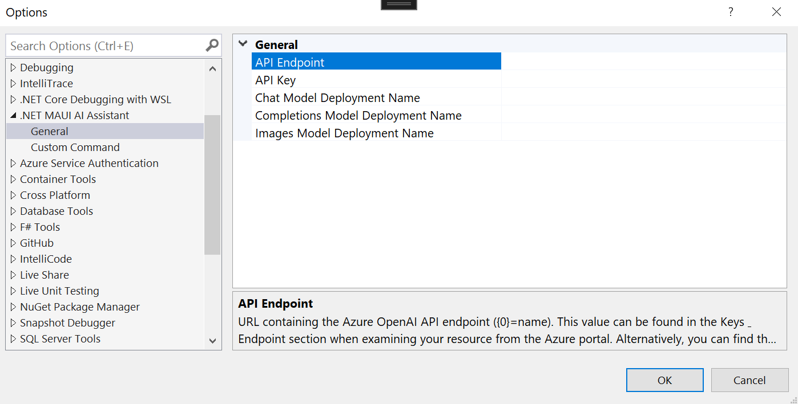
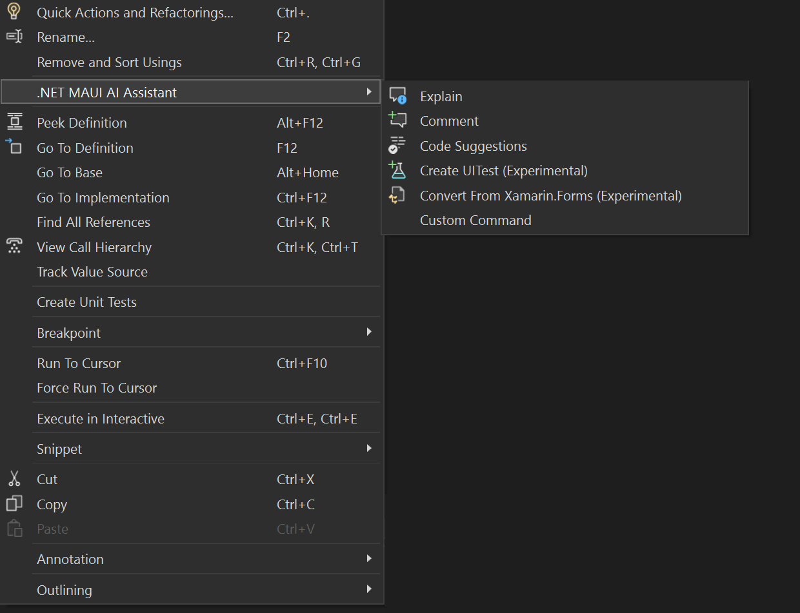
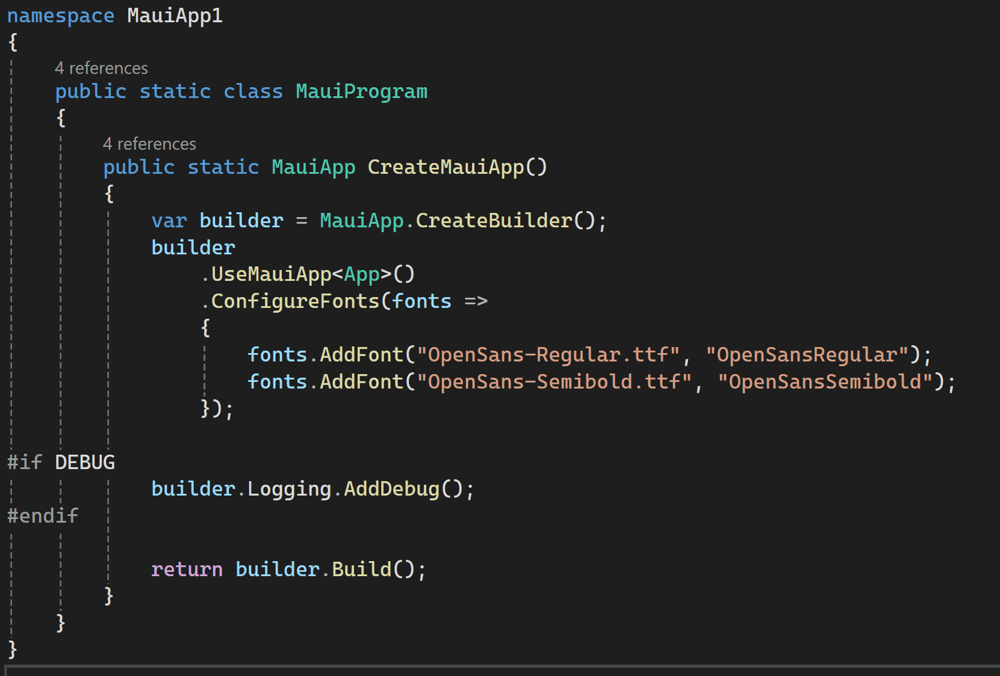
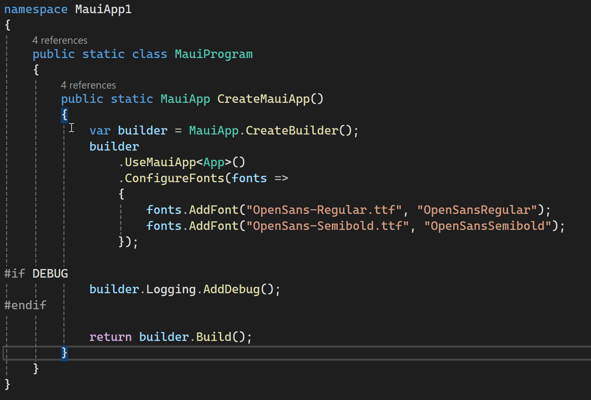
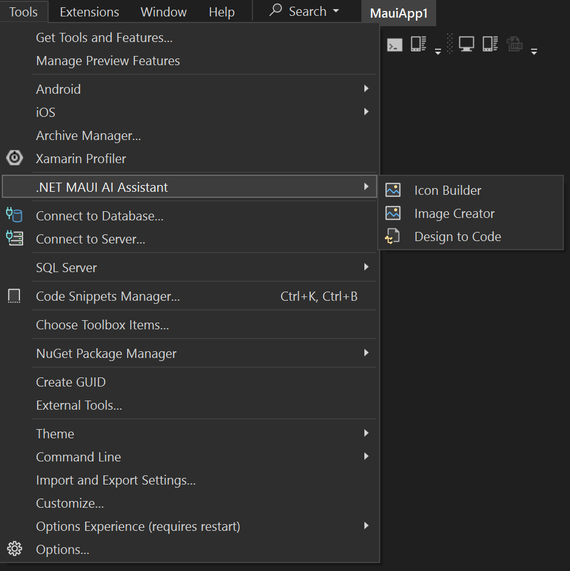
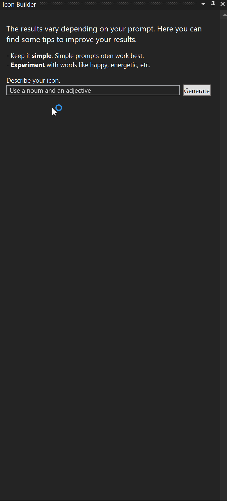

# .NET MAUI AI Assistant

_Work in progress_

Enhance your **.NET MAUI** development experience with this **AI-powered Visual Studio Extension**. This extension integrates seamlessly into Visual Studio, providing a suite of AI-driven tools designed to boost productivity and streamline your workflow, including: icon creation, generate code from designs, code explanation, comment generation and more.

## Prerequisites

An Azure subscription. 

## Setup

Sign in with your Azure subscription in the Azure portal. Create an **Azure OpenAI** resource.

Before you can use the extension, you need to deploy a model. You manage different models from **[Azure OpenAI Studio](https://oai.azure.com/)**. The model needed for the library would be gpt-4 or gpt-4o for all context menus, actions like adding comments, refactoring etc.

Although are optional, if you want to use tools like IconBuilder, you will need a dall-e-3 model. Whereas if you want to use Design to Code, you need a gpt-4 vision-preview model.

After creating the resource and the model/s you just have to add the values ​​in the extension settings.

## Functionality

### Explain Code

Highlight the lines of code you want to get an explanation for by clicking and dragging your mouse over them. Once the lines are selected, right-click on the highlighted area. From the context menu, select “.NET MAUI AI Assistant / Explain”.

The AI Assistant will analyze the selected code and display an alert with a detailed explanation of the code’s functionality and purpose. This feature is particularly useful for understanding complex code snippets or when you need a quick overview of what a particular section of code does. It can help you learn more about the code you’re working with and ensure that you understand its logic and structure.

### Comment Code
Click and drag your mouse over the lines of code you want to comment on. Make sure you highlight the exact lines. Once the lines are selected, right-click on the highlighted area.
From the context menu, select “.NET MAUI AI Assistant / Comment”.

The AI Assistant will then analyze the selected code and return it with detailed comments, explaining the functionality and purpose of each line or block of code. This feature is particularly useful for improving code readability and understanding, especially when working in teams or revisiting old code. It helps ensure that the logic and purpose of the code are clear to anyone who reads it later.

### Refactor Code

Highlight the lines of code you want to refactor by clicking and dragging your mouse over them. Once the lines are selected, right-click on the highlighted area. From the context menu, select “.NET MAUI AI Assistant / Refactor”.

The AI Assistant will analyze the selected code and return it refactored, improving its structure and readability without changing its behavior. This feature is particularly useful for optimizing your code, making it cleaner and easier to maintain.

## Tools

### Icon Builder

Click on Tools in the Visual Studio top menu, select .NET MAUI AI Assistant and click on Icon Builder.
Enter a prompt describing the icon you need. For example, you might type “vibrant shopping cart”.

The AI Assistant will generate a set of icons based on your prompt. You can select the icon you want to use and download it. This feature is great for quickly creating custom icons tailored to your application’s needs.

### Design to Code

Can select a screenshot from a design or even a drawing. Utilizing the advanced capabilities of OpenAI’s GPT-4 Vision multimodal LLM, the extension transforms the provided screenshot and instructions into .NET MAUI code, simplifying the development process and enabling rapid prototyping and implementation of UI designs.

